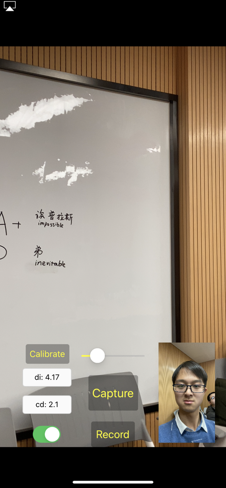
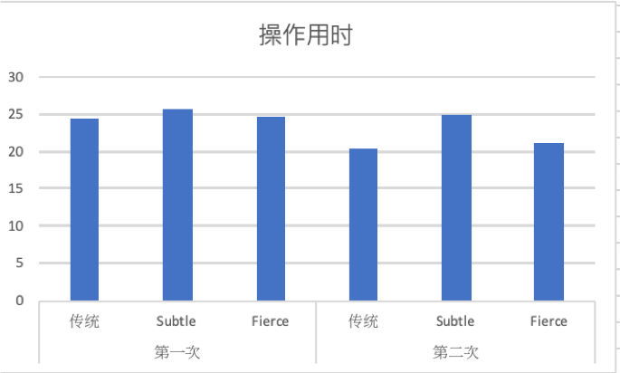
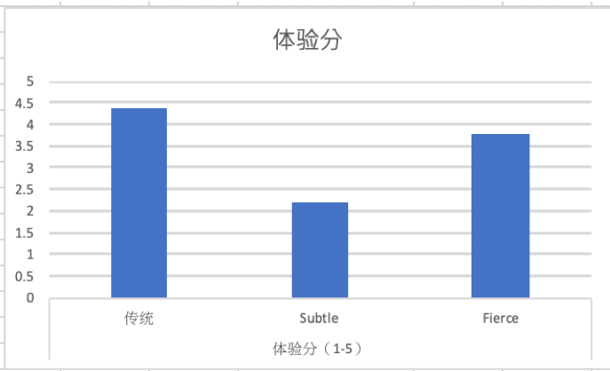
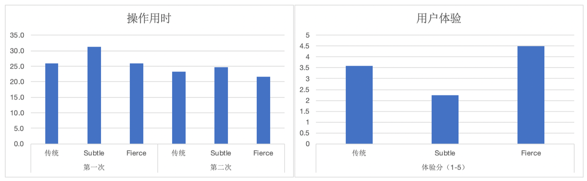

# IntelliZoomer

> This app is built on top of  [AVMultiCamPiP](https://developer.apple.com/documentation/avfoundation/cameras_and_media_capture/avmulticampip_capturing_from_multiple_cameras)

# 项目简介

项目名称：**IntelliZoomer--基于前摄CV的手机拍照辅助工具**

关键字：**人机交互、CV、移动设备**

## 提出背景

手机是与我们的生活最形影不离的计算设备，我们与手机的交互是无时无刻、无处不在的。作为忠实手机用户的我们，自然希望与手机的交互更简单，更便捷，更加贴合我们的自然需求。拍照是其中最为常见的一种交互之一。现在的智能手机拍照功能逐渐趋于多摄（前后、后置多摄像头等），多输出（视频、音频、深度等输出），用户体验也日臻流畅，但在一些特定的场合还是有不少值得改良的空间的。

拍照是用户最常用的手机功能之一，手机生产厂商也在极力地提升手机的拍摄能力。用户在拍照时常常会调整拍摄范围，通常调整拍摄范围的交互方式是在手机的触摸屏上用两个手指进行捏合或扩张。这种交互模式在双手持手机时体验较好，但是如果用户使用单手进行拍摄则会非常不便，因为如果仅使用一只手，则用户很难在握持手机的同时使用两个手指进行操作。而且需要单手拍摄的情景实际上是非常普遍的，比如：

* 拍摄某些时效性非常短的场景或者画面，如拍摄黑板上即将擦掉的文字时，用户往往会用单手去拿手机并打开拍照应用进行拍摄，此时如果需要调整拍摄范围，则往往需要使用另一只手。从单手切换到双手则会浪费不必要的时间，如果能单手快速完成拍摄范围调整工作则会大大提升用户体验。
* 很多时候用户的另一只手并不处于空闲状态，如用户手持咖啡，或者手拎购物袋，此时用户只能使用单手完成拍摄的全流程。

## 实现概述

经过前期调研与讨论，我们的项目最终按如下方案实现：打开手机前置摄像头，通过前置摄像头的深度数据（iPhoneX以上支持）或图像数据经过一定的CV处理，获得人脸到屏幕的距离信息；再根据“所见即所得”的要求，缩放率应正比于人脸到屏幕的距离，可推算出应采用的缩放率值；加时间窗平均后应用到后置摄像头上，实现**智能缩放**。用户微笑或者眨眼可以触发拍照（最终实现为微笑），提供完全 **touch free** 的拍照体验。

## 项目优势

相比于之前使用两根手指进行交互，我们提出的IntelliZoomer优势有：

* 简化了**单手拍摄**时调整拍摄范围时的交互方式。
* 实现**所见即所得**，从根源上尽量减小调整范围这个操作的频率和范围调整的幅度，从而提升此操作的效率。
* 实现**touch free**的拍摄，减少因为touch所导致手机的抖动，帮助用户提升拍摄质量。
* 交互模式更接近用户认知世界的方式，降低调整范围操作的学习难度，方便老人等对智能手机操作逻辑不熟悉的用户。

# 前期调研

## 用户需求调研

在项目前期，我们对用户的拍照习惯与需求进行了调研，调研对象为23名在读的清华大学学生，调研发现：

* 有13.04%的用户每日拍照多于10次，21.74%的用户每日拍照1-9次，60.87%的用户每周拍照若干次。
* 有43.49%用户每周有多次需要快捷拍照的需求。

通过数据可以看出，用户十分依赖手机的拍摄功能，快捷拍摄的需求广泛存在，因此我们确信，提升用户的拍摄速度与拍摄体验是必要的。

## 关键技术调研

### 苹果深度摄像头技术

苹果在iPhone X代之后的推出的iPhone前摄像头均为True Depth Camera，因此可以直接通过硬件获得深度数据。通过此数据即可在拍摄时获得人脸到手机前摄像头的距离。但是受限于硬件算力，True Depth Camera开启后，后置摄像头只能使用消耗算力较小的长焦镜头。

### 多摄像头同时工作技术

在WWDC 2019苹果开放了多摄像头工作的API给开发者，得益于此，我们可以在使用原生的接口，同时开启多个摄像头，因此可以实现前后摄像头同时开启，并且分别获得前后摄像头的所得到的数据。通过原生的API我们保证了IntelliZoomer的效率，实现了低延时，高效率。

### 人脸特征检测CV库

苹果官方提供了人脸识别的一些接口。接口一般接收摄像头数据作为输入（本质其实就是二维矩阵），再通过一系列的识别算法识别出人脸等信息。我们最终使用了AVFoundation中的CIDetector检测人脸，除了人脸的bounding box之外，还能识别出面部表情，例如微笑等。这部分的识别结果也是我们整个实现中至关重要的部分。

# 项目展示

如简介中所描述，我们的最终产品主要支持以下功能：

- 前后摄像头同时工作，后摄拍照和录制视频；
- 前摄检测人脸（若有多个人脸，检测最大者），通过人脸大小推算距离，控制后摄缩放适当程度；
- 微笑拍照，用户只需轻微一笑，即可触发拍照。该功能具有一定鲁棒性，例如不会被前摄看到的其他用户干扰；
- 校准功能（calibrate），允许不同用户定制适合自己面部大小的缩放映射；
- 通过滚动条可视化缩放率（下图capture按钮上方的滑条），滑动可以手动缩放；
- 开关自动缩放功能，隐藏/显示调试信息。

# 用户实验

## 实验设定

考虑在室内和室外拍照需求是不同的（在室外需要拍更远处的物体），因此我们的实验也分为了室内和室外两个场景。为了让拍摄的时间更加准确，我们让用户一次性拍摄一组物体，室内和室外均为5个物体，包括远处和近处，并记录拍摄所有物体所使用的时间。

在实际实验时，我们一共部署了三个App，一个是Naive Camera，调用了系统原生的API，但是没有防抖功能（因为我们的相机不能防抖）；另外两个都是我们的实现，分别为subtle和fierce方案，其中fierce方案变焦范围更大。

每个用户在实验室时，按照随机的顺序分别使用三个APP拍摄前面提到的一组物体，每组物体拍摄两次，计算平均时间。在实验完成之后，我们让用户为每个APP进行评分，范围为1-5，其中分数越高表示用户偏好性更强。另外，考虑到我们的APP在单手使用时具有很大的优势，我们还询问了用户在单手使用时会使用哪一种方案。

## 实验结果

实验结果显示，室内和室外稍有不同。

在室内的情况下，fierce方案和传统方案使用的时间基本一致，subtle方案的耗时最长。ANOVA分析表明，用户拍照所用时间和使用的APP没有明显的关系。

<figure>
    
    
</figure>

用户评分显示，室内情况下，用户偏好传统方案，所有用户表示在单手情况下会选择Fierce方案。实验结果和我们的预想有些出入，我们认为subtle方案在室内更好使用，因为缩放范围更小。后来发现原因在于部署app时subtle方案范围设置过小。

而在室外时，fierce方案用时更短，而且在第二次实验中优势更加明显，说明用户更为熟悉这种拍照方式。用户也给予了fierce方案更高的评分。另外，ANOVA分析结果显示用户拍照使用时间和使用的APP有明显的关系。

另外，所有的用户表明，在单手的情况下，他们会选择我们的拍照方案，说明我们的工作还是十分有用的。

此外，我们还收集了用户的一些建议，用户表明，经过练习，我们的拍照方式会更加方便。有的用户还指出，subtle适合拍生活，fierce适合拍风景。用户们的建议也为我们后续工作的改进指明了方向。

# 总结与未来工作

## 项目总结

我们目前完成的 IntelliZoomer 的实现已经能达到我们预期的人脸距离控制缩放率的功能预期，尝试了一些尖端的移动设备技术（例如多摄和CV库），我们也通过用户实验证实了我们的实现方案之于传统拍照方案在便捷性、单手性上的优势。总的来说，我们的项目具有较高的完成度，既涉及技术实现也包括用户实验。项目离不开每位组员的默契配合，最终大家都获益匪浅。在此也感谢老师和助教的悉心指导！

## 未来工作

我们的项目已申报挑战杯，将继续做后续扩展和完善的工作，争取做出更有价值的学术成果。

我们将遵循已有的设计思路，优化我们的实现在参数、算法的不完善之处，例如用回归模型或神经网络等学习模型优化算法参数，试图用更多计算机视觉技术直接从图像信息提取出缩放率信息等，实现更智能、更鲁棒的缩放特性。

同时，我们将继续注重用户体验，提升操作的顺滑性、自然性，例如引入眨眼拍照机制、加入手动辅助对焦等。最后，我们将开展更系统的用户实验，全方位评估最终作品的灵敏度、便捷度、交互舒适度等指标，证实作品的完成度，发布最终实现和开放公测。

